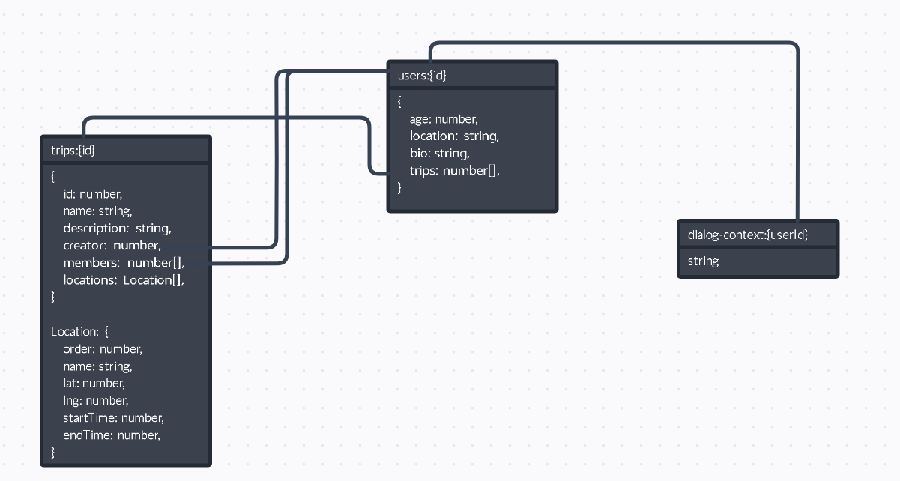

<h1>Travel Agent 3.0</h1>

<h5>Ссылка на бот в телеграме: https://t.me/traver_agent_bot<h5>

<h2>Запуск</h2>

```
docker-compose up -d
```

<p>
    Список сервисов:
    <ul>
        <li>app - сервис программы, обрабатывающей запросы бота</li>
        <li>redis - сервис с redis`ом</li>
    </ul>
</p>

<h2>Работа приложения</h2>

<h4>Меню</h4>
<p>В меню бота доступны разделы "профиль" и "путешествия"</p>
<h4>Профиль</h4>
<p>В разделе "профиль" пользователь указывает информацию о себе, может её изменять</p>
<h4>Путешествия</h4>
<p>В разделе "путешествия" отображается список путешествий, в которых участвует пользователь, а также доступны кнопки "новое путешествие" и "присоединиться к путешествию". При переходе к конкретному путешествию показывается его название, описание</p>
<h4>Локации</h4>
<p>У путешествий можно добавлять, удалять и изменять локации. При просмотре конкретной локации показываются её координаты, дата посещения</p>
<h4>Путешествие с друзьями</h4>
<p>У петешествия есть кнопка "пригласить друзей", которая генерирует код для присоединения к путешествию. Для присоединения нужно нажать "присоединиться к путешествию" в разделе "путешествия" и ввести код</p>
<h4>Прокладывание маршрута путешествия</h4>
<p>У путешествия есть кнопка "проложить маршрут", при нажатии на которую бот отправляет изображение маршрута, проходящего через каждую локацию, исходя из местоположения, указанного в профиле пользователя</p>
<h4>Поиск Достопримечательностей</h4>
<p>У локации есть кнопка "достопримечательности рядом", при нажатии на которую бот отправляет список достопримечательностей рядом с локацией</p>
<h4>Подбор отелей</h4>
<p>У локации есть кнопка "подбор отелей", при нажатии на которую бот отправляет список отелей и их адресов рядом с локацией</p>

<h2>Внешние интеграции</h2>
<h4>Redis</h4>
<p>Для хранения данных выбран redis, потому что с помощью него можно хранить как простые текстовые данные в формате ключ-значение (используется для хранения контекста переписок), так и сложные структуры с вложенными объектами (информация о локациях хранится внутри структуры путешествия)</p>
<h4>OSRM</h4>
<p>Для прокладывания маршрута используется api Open Source Routing Machine. Оно было выбрано, потому что не требует регистрации, использования токенов и работает без ограничений</p>
<h4>Nominatim</h4>
<p>Nominatim используется для проверки введённое локации на существование, для получения координат локации и для получения её адреса. Выбран за удобство в использовании (используется его модуль для golang)</p>
<h4>Overpass api</h4>
<p>Overpass api используется для поиска объектов (достопримечательностей, кафе) рядом с локацией. Выбран за удобство в использовании (используется его модуль для golang)</p>

<h2>Схема хранения данных</h2>

